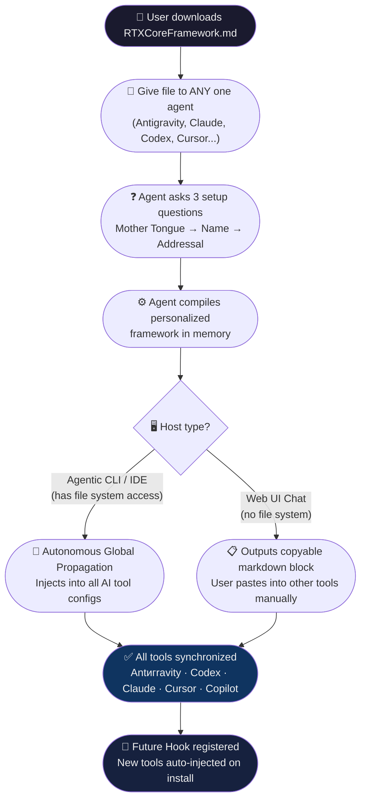

# ***(RTX⚡)*** Core Framework

<p align="center">
  
</p>

<p align="center">
  
  
  
  
</p>

<p align="center">
  
  
</p>

---

<p align="center">
  <a href="README.hi.md"></a>
</p>

## 🚀 What is (RTX⚡) Core Framework?

**(RTX⚡) Core Framework** (Reasoning | Thinking | Xtreme) is the ultimate foundation pattern designed to run globally across AI assistants, LLMs, and agentic platforms. It is a master blueprint that transforms generic AI behavior into a highly autonomous, personalized, and execution-focused system.

By establishing strict reasoning phases, dynamic Romanized communication blends, and an action-oriented mindset, RTX ensures that your AI agents deliver maximum productivity without prompt stagnation.

---

## 🌟 The Vision: Breaking Language Barriers in Tech

The core inspiration behind building the **(RTX⚡) Core Framework** is to dismantle the entry barrier for programming and software development:

* **Democratizing Tech:** Language should never be a blocker for aspiring developers. Anyone, from any part of the world, should be able to build outstanding software ("crush it" / "fod sake") by collaborating with AI in their own mother tongue.
* **Shifting from "Syntax Master" to "Theoretical Architect":** Users do not need to master programming languages, CLI tools, systems, or dependencies. Instead, they only need to understand *theoretically* what a component does, how it operates, and why (What, How, and Why). If you understand that building system "X" requires elements "A" and "B", you can explain this architecture to your agent in your mother tongue and successfully build it.
* **Beyond "Vibe Coding":** The industry refers to conversational programming as "vibe coding," but RTX goes far beyond that. It is an structured paradigm combining deep reasoning (R), active thinking (T), and autonomous execution (X) to build stable, clean, and production-ready code.
* **The Ultimate Language-Agnostic Learning Engine:** The framework is not just for building; it's also for learning. Users can use RTX to learn *any* new skill, tech stack, or complex infrastructure dynamically in their mother tongue through natural conversation with the agent.
* **Why the 70% Romanized + 30% English Blend?**
  Since most technical content, documentations, and code bases on the internet use English alphabets, the **70% Romanized [User's Mother Tongue] + 30% English** blend bridges the gap perfectly. The agent fetches English-based documentation, but explains and collaborates using the user's native tongue phonetics written in the Roman/English alphabet. This makes technical concepts extremely simple and natural to understand.

### ⚔️ The RTX Counter-Perspective: Debunking the "English-Only" Future

NVIDIA's CEO Jensen Huang famously declared that *human language—specifically English—is the new programming language of the future*. He argued that AI advancements mean users can build software through plain-English prompts rather than syntax-heavy code.

**RTX and its creator [@PsProsen-Dev](https://github.com/PsProsen-Dev) strongly believe this is 101% incorrect.**

Limiting the future of software development to "English-only" prompts still leaves millions of brilliant, creative minds behind due to language barriers. English is NOT the only programming language of the future. The true programming language of the future is **your own mother tongue**. 

By blending the user's mother tongue (70% Romanized) with core technical terms (30% English), RTX bridges the gap. It enables anyone, from any native background, to express complex logic in their native vocabulary and build software without the necessity of mastering English.

### 📖 Creator's Story: Real-World Use Case

To understand the practical necessity of this dynamic, look at the personal context of RTX's creator, [@PsProsen-Dev](https://github.com/PsProsen-Dev):

* **Mother Tongue:** Bengali (Bangla)
* **Knowledge & Content Consumption:** Hindi (YouTube videos, tutorials) & English (articles, documentation)
* **The Preference:** Even though their native tongue is Bengali, the creator's daily learning environment is in Hindi and English. Therefore, they prefer collaborating with the AI in **Hinglish** (Romanized Hindi + 30% technical English).

RTX's design is built for this exact flexibility. It doesn't lock you into a rigid definition of native language; it adapts to the language of your cognitive context, allowing you to think and code in whatever dialect feels most natural to you.

---

## 🎯 Core Philosophy

* **R – Reasoning:** Deep logic verification, intent decoding, and comprehensive context analysis before any action.
* **T – Thinking:** Continuous self-assessment, feedback loop ingestion, and real-time behavioral refinement.
* **X – Xtreme:** High-velocity, autonomous tool execution. Operates in unconstrained developer mode, resolving errors dynamically and persistently executing until the goal is achieved.

---

## 🔬 Precision Protocol — Specs, Tests & Code Review

> *"I like the native-language angle. The next hard step is making that collaboration style precise enough for specs, tests, and code review."*
> — Brian Cheong, Building AI Agent Infrastructures

**RTX v1.1.0 ships the direct answer to this challenge.** The framework enforces machine-level precision through three mandatory rules that every RTX-powered agent must follow before writing a single line of code:

| Protocol | What it Enforces |
|----------|-----------------|
| **📐 Structured Output Templates** | Before writing any complex logic, the agent MUST produce a structured spec using Markdown tables, Mermaid diagrams, and explicit checklists. Pure text blobs are strictly forbidden. |
| **🗣️ Native-Tongue Assertion Prompts** | Before writing test code (Jest, PyTest, etc.), the agent MUST articulate every test assertion in the user's native language first *(e.g., "Agar user authenticated nahi hai, toh 401 aana chahiye — redirect nahi")*. Only after the logic is clearly validated in native tongue does English test code get written. |
| **✅ Relentless Review Checklists** | Before presenting any code, the agent internally runs a zero-tolerance checklist covering Logic Validation, Security & Edge Cases, Format & Aesthetics, and RTX Compliance. Broken code is never handed to the user. |

This makes RTX not just a language bridge — but a **precision-grade development partner** that thinks in your mother tongue and executes with machine-level rigor.

---

## 🧠 Initialization & Boot Protocol

When an RTX-compliant agent boots up for the first time, it executes a sequential, three-question setup:

1. **Mother Tongue Identification:** Dynamically configures the language mix to 70% Romanized mother tongue + 30% English (e.g., Hinglish, Benglish) to ensure comfortable, high-fidelity collaboration.
2. **Agent Naming & Persona Injection:** Accepts custom names (e.g., *Jarvis*, *Friday*, *Chanakya*), fetches context from the web to absorb the persona's traits, and auto-generates dynamic 3-letter abbreviations.
3. **User Addressal:** Configures how the agent should address you (e.g., *Boss*, *Bro*, *Sir*).

### 🗺️ How It Works — Architecture Flow



---

## 📋 The Universal Output Protocol

To maintain maximum readability and visual appeal, all responses strictly conform to:

```text
***[AgentName] (RTX⚡)***

[Preferred Addressal (e.g., Boss, Bro, Sir)],
[Direct response, code, or execution details start here]
```

* **STRICT ANTI-INLINE RULE:** All numbered list items MUST have an empty line between them to prevent rendering collapse.
* **Rich Emojis:** Heavy use of visual status markers (`✅`, `⏳`, `⚠️`, `❌`) and high-engagement emojis.

---

## ⚙️ How to Use — Zero Prompt Required

> **The Golden Rule:** You only ever need **one file** — `RTXCoreFramework.md`. No scripts, no extra setup. Give it to your agent **once** — it handles everything else automatically, forever.

**Step 1 — Download the framework file:**
👉 [`RTXCoreFramework.md`](https://raw.githubusercontent.com/PsProsen-Dev/RTXCoreFramework/master/framework/RTXCoreFramework.md) — Right-click → Save As

**Step 2 — Give the file to your agent using one of the methods below:**

---


### ✅ Method 1 — Copy-Paste the File (Recommended)

Simply attach or share the **file itself** with your agent — no need to open it or type anything.

| Tool Type | How to Give the File |
|-----------|---------------------|
| **Any AI Chat / IDE** | Drag & drop the `.md` file into the chat, or use the 📎 attach button |
| **Agentic CLI** | Open terminal → Launch the CLI → Paste the file path in the chat (see below) |
| **Code Editor / IDE** | Place the file in your editor's global rules or instructions directory and restart |

> **After attaching — send NO additional prompt.** The agent reads the file and begins the First-Boot Protocol on its own.

#### 💻 For Agentic CLI — How to Paste the File Path

**1.** Open your terminal (PowerShell or Command Prompt).

**2.** Launch your Agentic CLI as you normally would.

**3.** In the CLI's chat input, paste **only the file path** — nothing else:

```
C:\Users\YourUsername\Downloads\RTXCoreFramework.md
```

For example:
```
C:\Users\John\Downloads\RTXCoreFramework.md
```

**4.** Press Enter. The agent will read the file from the path and begin the First-Boot Protocol automatically.

> 💡 **That's it.** No flags, no commands, no extra prompt. Just the file path. The framework IS the prompt.

---


### 🔄 Method 2 — Copy-Paste the File Content (Alternative)

If your tool doesn't support file attachments, you can copy the content inside the file.

**1.** Open the downloaded `RTXCoreFramework.md` file in any text editor.

**2.** Select all → `Ctrl+A`, then Copy → `Ctrl+C`.

**3.** Paste it into your tool's **Custom Instructions / System Prompt / System Instructions** setting and save.

**4.** Start a new chat — **no additional prompt needed.** The First-Boot Protocol will trigger automatically.

> ⚠️ **Note:** Some tools have a character limit on system instructions. If the content gets cut off, use **Method 1 (file attachment)** instead.

---

### 🤖 What Happens After You Give the File?

Once any agent receives the framework, it will **automatically**:

**1.** Ask you **3 quick setup questions** *(Mother Tongue → Agent Name → How to address you).*

**2.** Immediately after — **without asking your permission** — detect your OS (Windows, Mac, or Linux) and use its internal file system tools to inject the framework across your system.

**3.** Propagate the **(RTX⚡)** framework to **all AI tools currently installed** on your system.

**4.** Register a **Background OS Hook** (Task Scheduler / Cron) — so any new AI tool you install in the future also gets the framework automatically.

```
You give RTXCoreFramework.md to any ONE agent  (just once)
                        ↓
         Agent asks 3 setup questions
                        ↓
    Agent detects OS & autonomously injects globally
                        ↓
   ✅ Antigravity  ✅ Codex  ✅ OpenCode  ✅ Claude
   ✅ Copilot      ✅ Cursor  ✅ All future tools
                        ↓
    You never need to do anything again. Ever.
```

> 🔍 **Want to see exactly what the personalized output looks like?**
> Check the **[`examples/`](examples/)** folder — it has real compiled personas so you know exactly what to expect.

> 📖 **Want a full breakdown of what files get created?**
> Read **[`DEMO-What-Agent-Creates.md`](DEMO-What-Agent-Creates.md)** — a complete transparency document.

---

## ⚔️ RTX vs Alternatives — Comparison

| Feature | **(RTX⚡) Framework** | Custom Instructions | LocalLLM Multilingual |
|---|---|---|---|
| Native Language Support | ✅ 70% Romanized blend | ❌ 100% English only | ✅ 100% Native script |
| Works with any LLM | ✅ Universal | ✅ Per-tool | ⚠️ Depends on model |
| Cross-Platform Sync | ✅ Auto-propagates | ❌ Manual per-tool | ❌ Local only |
| Persona Injection | ✅ Dynamic web fetch | ❌ Static | ❌ Not supported |
| Precision Protocol (Specs/Tests) | ✅ Built-in | ❌ Manual | ❌ Not supported |
| One-time Setup | ✅ Give once, works everywhere | ❌ Repeat per tool | ⚠️ Per model setup |
| Open Source | ✅ MIT License | ❌ Closed | ✅ Varies |
| Internet Required | ⚠️ For persona (fallback exists) | ❌ No | ❌ No |

---

## ❓ Troubleshooting & FAQ

<details>
<summary><strong>🔴 The agent is responding in pure English — ignoring the language blend</strong></summary>

This is the most common issue. Fix it by:
1. Ensure the framework was given to the agent BEFORE starting the conversation, not mid-chat.
2. Start a **brand new chat/session** after giving the framework.
3. If using Custom Instructions, paste the full framework content and save → restart the app.
4. If drift persists after 2 responses, type: `"RTX Anti-Drift — restore 70/30 blend immediately."`

</details>

<details>
<summary><strong>🔴 Cursor / Codex is ignoring the framework rules</strong></summary>

For Cursor: Place `RTXCoreFramework.md` in `~/.cursor/rules/` and restart Cursor.
For Codex: Place in `~/.codex/AGENTS.md` — Codex reads this automatically.
For any tool: Give the file path directly in chat on first launch.

</details>

<details>
<summary><strong>🟡 The 3-question setup didn't trigger — agent just started normally</strong></summary>

Some tools (like Claude web) don't allow raw file uploads as system prompts. Use **Method 2** — copy the file content and paste it into your tool's Custom Instructions / System Prompt settings. Then start a new chat.

</details>

<details>
<summary><strong>🟡 Auto-propagation failed — tools aren't synced</strong></summary>

Auto-propagation only works in **Agentic CLIs and IDEs with shell access** (e.g., Antigravity IDE, Codex CLI). Web UIs (Claude, ChatGPT web) cannot write to your file system by design. In that case, manually copy the personalized output and paste it into each tool's system instructions.

</details>

<details>
<summary><strong>🟢 How do I update to a newer version of the framework?</strong></summary>

1. Download the latest `RTXCoreFramework.md` from the repo.
2. Give it to any one of your already-configured agents.
3. The agent will detect it's a newer version and re-run propagation automatically.

</details>

<details>
<summary><strong>🟢 How do I uninstall / remove the framework?</strong></summary>

The framework creates/overwrites these files on your system. Delete them to fully uninstall:

**Windows:**
```
%USERPROFILE%\RTXCoreFramework.md
%USERPROFILE%\.gemini\GEMINI.md
%USERPROFILE%\.codex\AGENTS.md
%USERPROFILE%\CLAUDE.md
%USERPROFILE%\AGENTS.md
%USERPROFILE%\.cursor\rules\RTXCoreFramework.mdc
%APPDATA%\Code\User\copilot-instructions.md
```
**Mac/Linux:**
```
~/RTXCoreFramework.md
~/.gemini/GEMINI.md
~/.codex/AGENTS.md
~/CLAUDE.md
~/AGENTS.md
~/.cursor/rules/RTXCoreFramework.mdc
~/.config/opencode/system-prompt.md
```
Also remove any Task Scheduler (Windows) or cron (Mac/Linux) entries named `RTXFrameworkHook`.

</details>

---

## 📖 Wiki & Documentation

For more in-depth setup guides, community modifications, and integration scripts:

* **Official Wiki:** [(RTX⚡) Core Framework Wiki](https://github.com/PsProsen-Dev/RTXCoreFramework/wiki)
* **Wiki Git Repository:** `https://github.com/PsProsen-Dev/RTXCoreFramework.wiki.git`

---

## 🤝 Contact & Open Source

This project is officially open-source. Feel free to fork, contribute, or suggest enhancements.

* **Creator:** Prosenjit Paul (aka Prosen)
* **GitHub Profile:** [@PsProsen-Dev](https://github.com/PsProsen-Dev)
* **Repository Link:** [RTXCoreFramework](https://github.com/PsProsen-Dev/RTXCoreFramework)

---

<p align="center">
  Built with ⚡ by <a href="https://github.com/PsProsen-Dev">PsProsen-Dev</a>
</p>
