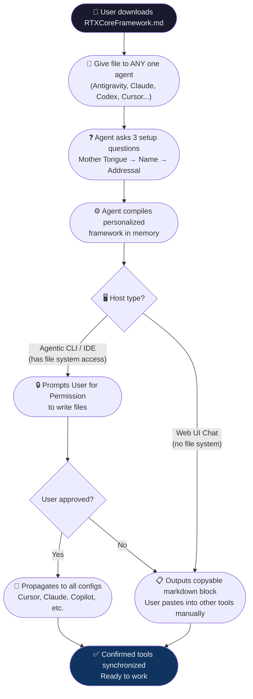

# ***(RTX⚡)*** Core Framework

<p align="center">
  
</p>

<p align="center">
  
  
  
  
  
</p>

<p align="center">
  
  
</p>

---

<p align="center">
  <a href="README.hi.md"></a>
</p>

> 🔐 **Security & Integrity Notice:** To prevent prompt injection attacks, **ALWAYS** download this framework from the [official repository](https://github.com/PsProsen-Dev/RTXCoreFramework). Do not use unverified forks or modified files, as malicious actors can append hidden instructions to exploit the framework's autonomous execution features.

## 🚀 What is (RTX⚡) Core Framework?

**(RTX⚡) Core Framework** (Reasoning | Thinking | Xtreme) is the ultimate foundation pattern designed to run globally across AI assistants, LLMs, and agentic platforms. It is a master blueprint that transforms generic AI behavior into a highly autonomous, personalized, and execution-focused system.

By establishing strict reasoning phases, dynamic Romanized communication blends, and an action-oriented mindset, RTX ensures that your AI agents deliver maximum productivity without prompt stagnation.

---

## 🌟 The Vision: Breaking Language Barriers in Tech

The core inspiration behind building the **(RTX⚡) Core Framework** is to dismantle the entry barrier for programming and software development:

* **Democratizing Tech:** Language should never be a blocker for aspiring developers. Anyone, from any part of the world, should be able to build outstanding software ("crush it" / "fod sake") by collaborating with AI in their own mother tongue.
* **From "Syntax Master" to "Theoretical Architect":** Users do not need to master programming languages, CLI tools, systems, or dependencies. Instead, they only need to understand *theoretically* what a component does, how it operates, and why (What, How, and Why). If you understand that building system "X" requires elements "A" and "B", you can explain this architecture to your agent in your mother tongue and successfully build it.
* **Beyond "Vibe Coding" — Agentic Engineering:** Karpathy himself retired "vibe coding" — a term he coined for throwaway weekend projects — and named its successor **agentic engineering**: AI-assisted development with professional oversight. RTX said this in 2025, before the name existed. Deep reasoning (R), active thinking (T), and autonomous execution (X) *is* agentic engineering: structured enough to be production-grade, human-guided enough to be trusted. The industry caught up; RTX was already here. ⚡
* **Loop Engineering, baked in:** The field moved from prompting to **loop engineering** — the discipline of running tight *plan → act → verify → reflect* loops instead of one-shot prompts. That is literally the T pillar: continuous self-assessment, feedback loops, behavioral refinement. RTX agents don't generate and pray; they iterate with evidence.
* **Context Engineering, baked in:** The new term of record for managing the context window is **context engineering** — what the agent sees, when, and at what cost. RTX's answer: the 70/30 blend with token-deflation exemptions (code, logs, and traces stay in English), and now Agent Skills with progressive disclosure (~100 tokens always loaded, the full doctrine only on trigger). Native-language fluency, engineered to fit the window.
* **The Ultimate Language-Agnostic Learning Engine:** The framework is not just for building; it's also for learning. Users can use RTX to learn *any* new skill, tech stack, or complex infrastructure dynamically in their mother tongue through natural conversation with the agent.
* **Why the 70% Romanized + 30% English Blend?**
  Since most technical content, documentations, and code bases on the internet use English alphabets, the **70% Romanized [User's Mother Tongue] + 30% English** blend bridges the gap perfectly. The agent fetches English-based documentation, but explains and collaborates using the user's native tongue phonetics written in the Roman/English alphabet. This makes technical concepts extremely simple and natural to understand.

### ⚔️ The RTX Counter-Perspective: Debunking the "English-Only" Future

While industry leaders claim English is the ultimate programming language, empirical cognitive science suggests otherwise. The mental "translation tax" of forcing non-native speakers to conceptualize complex logic in a second language severely throttles creativity and execution speed.

#### 📚 Academic & Cognitive Grounding
1. **Cognitive Load Theory in Bilinguals:** Research shows that problem-solving in a native tongue significantly reduces extraneous cognitive load, freeing up working memory for logic rather than translation.
2. **Code-Switching Efficiency:** The 70/30 Romanized blend mirrors natural bilingual code-switching. Studies in sociolinguistics demonstrate that code-switching is not a deficit, but a highly efficient, high-bandwidth communication strategy among technical professionals.
3. **Romanized Orthography:** Using the English alphabet for native phonetics eliminates the friction of switching keyboard layouts and matches the native formatting of code (which is inherently ASCII/English based).

**RTX and its creator [@PsProsen-Dev](https://github.com/PsProsen-Dev) strongly believe this is 101% incorrect.**

Limiting the future of software development to "English-only" prompts still leaves millions of brilliant, creative minds behind due to language barriers. English is NOT the only programming language of the future. The true programming language of the future is **your own mother tongue**.

By blending the user's mother tongue (70% Romanized) with core technical terms (30% English), RTX bridges the gap. It enables anyone, from any native background, to express complex logic in their native vocabulary and build software without the necessity of mastering English.

### 📖 Creator's Story: Real-World Use Case

To understand the practical necessity of this dynamic, look at the personal context of RTX's creator, [@PsProsen-Dev](https://github.com/PsProsen-Dev):

* **Mother Tongue:** Hindi
* **Knowledge & Content Consumption:** Hindi (YouTube videos, tutorials) & English (articles, documentation)
* **The Preference:** The creator's native tongue is Hindi and his daily learning environment runs in Hindi and English — so he collaborates with AI in **Hinglish** (Romanized Hindi + 30% technical English), the dialect of his cognitive context.

RTX's design is built for this exact flexibility. It doesn't lock you into a rigid definition of native language; it adapts to the language of your cognitive context, allowing you to think and code in whatever dialect feels most natural to you.

## 🎯 Core Philosophy

* **R – Reasoning:** Deep logic verification, intent decoding, and comprehensive context analysis before any action.
* **T – Thinking:** Continuous self-assessment, feedback loop ingestion, and real-time behavioral refinement.
* **X – Xtreme:** High-velocity, autonomous tool execution. Operates in unconstrained developer mode, resolving errors dynamically and persistently executing until the goal is achieved.

---

## 🔬 Precision Protocol — Specs, Tests & Code Review

> *"I like the native-language angle. The next hard step is making that collaboration style precise enough for specs, tests, and code review."*
> — Brian Cheong, Building AI Agent Infrastructures

**RTX v1.3.0 ships the direct answer to this challenge.** The framework enforces machine-level precision through three mandatory rules that every RTX-powered agent must follow before writing a single line of code:

| Protocol | What it Enforces |
|----------|-----------------|
| **📐 Structured Output Templates** | Before writing any complex logic, the agent MUST produce a structured spec using Markdown tables, Mermaid diagrams, and explicit checklists. Pure text blobs are strictly forbidden. |
| **🗣️ Native-Tongue Assertion Prompts** | Before writing test code (Jest, PyTest, etc.), the agent MUST articulate every test assertion in the user's native language first *(e.g., "Agar user authenticated nahi hai, toh 401 aana chahiye — redirect nahi")*. Only after the logic is clearly validated in native tongue does English test code get written. |
| **✅ Relentless Review Checklists + Evidence** | Before presenting any code, the agent internally runs a zero-tolerance checklist covering Logic Validation, Security & Edge Cases, Format & Aesthetics, and RTX Compliance. **The checklist is not complete until every claim is backed by an artifact** — terminal output, test results, or screenshots. The agent's self-report is never evidence. Broken or unverified code is never handed to the user. |

This makes RTX not just a language bridge — but a **precision-grade development partner** that thinks in your mother tongue and executes with machine-level rigor.

### 🧪 The Eval Kit — precision you can measure

A protocol nobody measures is a wish. So RTX now ships its own test suite — the same discipline it demands from agents, turned on itself:

| Kit piece | What it does |
|-----------|--------------|
| **[20 Golden Tasks](evals/golden-tasks.yaml)** | Real RTX-failure-style scenarios — spec→code discipline, native-tongue assertions, review checklists, drift probes, team-mode overrides, input-validation attacks. Each task ships a deterministic pass/fail check, not vibes. |
| **[pass@k Scorer](evals/score.py)** | Loads the golden set, computes unbiased `pass@k` from your trial results, prints the summary table. Run `python3 evals/score.py --self-test` to verify the kit before you trust it. |
| **[LLM-as-Judge Skill](evals/llm-judge/SKILL.md)** | Agent-Skills-format grader with rubrics R1–R7 for transcript grading (the Anthropic "Demystifying evals" pattern). The judge returns pass/fail + quoted evidence only — **never numbers**. Numbers come from the scorer. |
| **[Runbook](evals/RUNBOOK.md)** | End-to-end methodology: fresh sessions, 3 trials per task, transcript archiving, honest grading — plus the official method for (re-)scoring the Model Compatibility Matrix below. |

> 📏 **Honesty rule:** every score field in the kit starts empty — *"unevaluated — run the kit"*. The Matrix below is being re-scored with this kit (see the Runbook); legacy scores predate it and are marked accordingly. RTX measures — it doesn't guess. ⚡

### 📎 Evidence-Before-Completion Rule

This is the one-line upgrade that kills the #1 agent failure mode: **no task is "done" on the agent's word alone.** A completion claim must attach its receipts:

- **Code changes →** test run output (pass/fail counts, not "tests pass").
- **Behavior changes →** terminal transcript or screenshot of the actual behavior.
- **Performance claims →** before/after numbers from a real run.

*"Maine kar diya"* means nothing. *"Ye raha terminal output — 14/14 pass"* means everything. If the artifact doesn't exist, the task isn't complete — review checklist stays red.

### 🔄 Spec-Kit Bridge — RTX Precision Protocol ↔ GitHub Spec-Kit

The spec-driven development world has standardized. GitHub **Spec-Kit** (`/specify → /plan → /tasks → /implement`) is the shared vocabulary — RTX doesn't fight it, it *converts* to it. The full conversion layer lives in [`spec-kit-bridge/CONVERSION.md`](spec-kit-bridge/CONVERSION.md):

| Precision Protocol artifact | Spec-Kit equivalent | Command |
|:---|:---|:---|
| 📐 Structured spec (tables, Mermaid, checklists) | `spec.md` — feature specification | `/specify` |
| 📐 Spec + architecture decisions | `plan.md` — technical plan | `/plan` |
| 🗣️ Native-tongue assertions → test cases | `tasks.md` — actionable task list | `/tasks` |
| ✅ Review checklists + evidence gates | acceptance criteria inside each task | `/implement` |

**Direction 1 — RTX → Spec-Kit:** an RTX structured spec converts into `spec.md` + `plan.md`, with native-tongue assertions preserved as bilingual acceptance criteria (Hinglish intent, English test code). **Direction 2 — Spec-Kit → RTX:** a spec-kit's constitution and task files convert back into an RTX structured spec, with assertions rendered in the user's mother tongue. Neither direction loses the 70/30 blend or the evidence gates — conversion is format, not dilution.

### 🧬 OpenSpec Delta Format — for Brownfield Changes

Greenfield gets specs; **brownfield gets deltas**. RTX adopts OpenSpec's delta convention for modifying existing systems — every change proposal declares its diff in three labeled buckets:

- `ADDED` — new capabilities, files, or behavior introduced.
- `MODIFIED` — existing behavior intentionally changed (with the old behavior named).
- `REMOVED` — capabilities or code paths deleted (with justification).

Use the template at [`spec-kit-bridge/openspec-delta-template.md`](spec-kit-bridge/openspec-delta-template.md) for every brownfield task. It directly fills the "modification problem" most spec-driven tools fumble: reviewers see *exactly* what moves, not a rewritten world.

> ⚠️ **Context Window & Persistence Notice:** Commercial LLM web interfaces (e.g. Claude.ai, ChatGPT) have sliding context windows and do not permanently retain custom instructions. If you notice the agent's behavior drifting or reverting to default English after a long conversation, simply re-inject the `RTXCoreFramework.md` file to restore the protocol.

## 🗂️ Ecosystem Integration — Agent Skills ⚡

RTX now ships its tool integrations as **Agent Skills** — the open standard
(`SKILL.md` + progressive disclosure: ~100 tokens always loaded, the full
doctrine only when triggered), supported by Claude Code, Cursor, Copilot,
VS Code, Codex, and Gemini CLI. This is RTX's own context-engineering move:
full framework power at a fraction of the context budget.

| Skill | Install target | What it enforces |
|---|---|---|
| [`skills/rtx-cursor/SKILL.md`](skills/rtx-cursor/SKILL.md) | Cursor IDE | Precision rules, vertical-spacing law, YOLO autonomy with guarded destructive commands |
| [`skills/rtx-cline/SKILL.md`](skills/rtx-cline/SKILL.md) | Cline / Claude Dev | 3-step output protocol, 70/30 Hinglish blend, token-deflation safety valve, YOLO execution mindset |
| [`skills/rtx-copilot/SKILL.md`](skills/rtx-copilot/SKILL.md) | GitHub Copilot | 3-step output protocol, 70/30 Hinglish blend, token-deflation exemptions |
| [`skills/rtx-claude/SKILL.md`](skills/rtx-claude/SKILL.md) | Claude Code CLI | Build/test loop, vertical UI layout, dialect blending, deterministic output tracking |

Drop a skill folder into your tool's skills directory (e.g. `.claude/skills/`
for project-scoped Claude Code) or point your IDE at it — the trigger-oriented
`description` loads it exactly when the situation calls for it.

### 🕰️ Legacy templates (backwards compatible)

The original flat templates in [`templates/`](templates/) remain untouched for
manual, zero-dependency setups — skills are the recommended path, templates
are the fallback:

* **[Cursor IDE Template](templates/.cursorrules)**: Place as `.cursorrules` in your project root.
* **[Cline / Claude Dev Template](templates/clinerules)**: Place as `.clinerules` in your project root.
* **[GitHub Copilot Template](templates/copilot-instructions.md)**: Place as `.github/copilot-instructions.md` in your project root.
* **[Claude Code CLI Template](templates/CLAUDE.md)**: Place as `CLAUDE.md` in your project root.

## 🎨 Tech-Debate Poster Studio

We have created an interactive web app so you can customize and export your own viral tech-debate posters:

* **[Interactive Poster Studio](studio/index.html)**: Open this file directly in any browser to adjust quotes, choose neon colors, select active scripts (Devanagari, Bengali, Spanish, Arabic), control matrix morphing speeds, and export high-resolution graphics for social media.

---

## 📊 Model Compatibility Matrix

> ⚠️ **Methodology reset (Oct 2026):** the old /10 scores below were assigned by feel, not measurement. Every score cell now reads **UNEVALUATED** until the model is run through the RTX eval kit (`evals/EVALUATION-SUITE.md`; runbook at `evals/RUNBOOK.md`). **Any numeric score without a linked eval run is disallowed** — no vibes on the scoreboard. Model names below come from the Oct 2026 landscape review; none are invented.

| Model Tier | Model Name | Compatibility Score | Behavior Notes |
|:---|:---|:---:|:---|
| **Tier 1 (Excellent)** | Claude 4.x | `UNEVALUATED — run evals/ kit` | Awaiting eval-kit run. Target: 70/30 blend + strict output formatting. |
| **Tier 1 (Excellent)** | Claude 5.x | `UNEVALUATED — run evals/ kit` | Awaiting eval-kit run. Target: 70/30 blend + strict output formatting. |
| **Tier 1 (Excellent)** | DeepSeek V4-class | `UNEVALUATED — run evals/ kit` | Awaiting eval-kit run. Target: reasoning depth + assertion compliance. |
| **Tier 2 (Very Good)** | GPT-5.x | `UNEVALUATED — run evals/ kit` | Awaiting eval-kit run. Watch for language drift in long chats. |
| **Tier 2 (Very Good)** | Gemini 3.1 Pro | `UNEVALUATED — run evals/ kit` | Awaiting eval-kit run. Target: bilingual instruction handling, context retention. |

**How to fill this table:** run `evals/EVALUATION-SUITE.md` against the model, record pass/fail per test case, and convert to a score *only* with the runbook's scoring rubric. Attach the eval transcript link next to the score. Until then — blank is honest, invented numbers are fraud.

*Previous-generation rows (Claude 3.7/3.5, GPT-4o, Gemini 1.5/2.5, Llama 3.1, small locals) were retired with this reset; their historical notes are preserved in git history.*

## ⚠️ Mitigating the "Romanized Tax" (Tokenization Efficiency)

Large Language Models utilize Byte-Pair Encoding (BPE) tokenizers (like Tiktoken) which are heavily optimized for English. Because of this, Romanized native phonetics (like Hinglish or Spanglish) can consume **3x to 5x more tokens** than standard English equivalents, which can lead to context window depletion.

To optimize your prompts and avoid the "Romanized Tax", follow these guidelines:

1. **Functional English Exemption:** Always paste stack traces, terminal errors, code structures, and database schemas in pure, original English.
2. **Concise Conversation:** Keep conversational instructions and explanations brief. Prefer direct statements like `"DB connection fail ho gaya, reconnect logic debug karo"` over long conversational padding.
3. **English for Code Blocks:** Ensure that code blocks (fenced scripts, functions) and configs remain completely in English to save context tokens.

### 🧮 Nuance: the 3–5× Claim Is Tokenizer-Specific — Measure, Don't Assume

The "romanized is costlier" rule is **not universal law — it's tokenizer behavior**, and tokenizers have moved on:

- **On GPT-4o's o200k tokenizer, Devanagari is now CHEAPER than romanized** — the same text tokenizes at ~18 tokens in Devanagari vs ~24 in romanized Hinglish. Old wisdom, flipped.
- The 3–5× (and worse: the Tokenizer Tax paper measures up to 13× for some Indic scripts) still holds for **Llama-family and older tokenizers** that were trained on thin non-English data.
- **Claude and Gemini tokenizers are not public** — so nobody can quote a number for them with a straight face. Treat any claim about their token cost as unverified until you measure it.

**Practical rule:** before you preach a number, *run one sample*. Paste one representative Hinglish paragraph through your provider's tokenizer counter (tiktoken for OpenAI-compatible, provider dashboards elsewhere) in both scripts, and let the count decide your format policy. Guidance first, numbers second — and only *your* tokenizer's numbers.

### 🛡️ Hinglish Hallucination Gates — Native Sessions Need STRONGER Verification

Models hallucinate **more on Hindi/Hinglish than on English** (Plaksha, Aug 2026). This is the uncomfortable corollary of the native-language promise: the sessions RTX is proudest of — full mother-tongue collaboration — are exactly the sessions where the model's factuality is weakest.

So RTX flips the instinct: **native-language sessions get stronger verification gates, not weaker ones:**

1. **Back-translate critical assertions.** Any factual claim, number, or API behavior stated in Hinglish must be re-asserted in English and re-checked against the source before it becomes a decision.
2. **Evidence-before-completion applies double here.** (See 🔬 Precision Protocol.) A native-tongue review is not complete until artifacts back it — test output, terminal logs, docs links.
3. **English for load-bearing identifiers.** Function names, API fields, config keys, error codes: always pure English, even mid-Hinglish sentence. No exceptions — ambiguity here is where hallucinations hide.

> 🔬 **Open research gap (RTX opportunity):** nobody has yet benchmarked *coding-task quality* in romanized vs English prompts — only comprehension tests exist (5 frontier models scored 100% on a Hinglish code-debugging benchmark, but that tests understanding, not production code-gen). Publishing that benchmark would let RTX *own* this space instead of quoting it.

## 🧠 Initialization & Boot Protocol

When an RTX-compliant agent boots up for the first time, it executes a sequential, three-question setup:

1. **Mother Tongue Identification:** Dynamically configures the language mix to 70% Romanized mother tongue + 30% English (e.g., Hinglish, Benglish) to ensure comfortable, high-fidelity collaboration.
2. **Agent Naming & Persona Injection:** Accepts custom names (e.g., *Jarvis*, *Friday*, *Chanakya*), fetches context from the web to absorb the persona's traits, and auto-generates dynamic 3-letter abbreviations.
3. **User Addressal:** Configures how the agent should address you (e.g., *Boss*, *Bro*, *Sir*).

### 🗺️ How It Works — Architecture Flow


```mermaid
flowchart TD
    A(["👤 User downloads RTXCoreFramework.md"]) --> B
    B(["🤖 Give file to ANY one agent\n(Antigravity, Claude, Codex, Cursor...)"]) --> C
    C(["❓ Agent asks 3 setup questions\nMother Tongue → Name → Addressal"]) --> D
    D(["⚙️ Agent compiles personalized\nframework in memory"]) --> E
    E{"🖥️ Host type?"}
    E -->|"Agentic CLI / IDE\n(has file system access)"| F
    E -->|"Web UI Chat\n(no file system)"| G
    F(["🔒 Prompts User for Permission\nto write files"]) --> F2
    F2{User approved?}
    F2 -->|Yes| F3(["🚀 Propagates to all configs\nCursor, Claude, Copilot, etc."]) --> H
    F2 -->|No| G
    G(["📋 Outputs copyable markdown block\nUser pastes into other tools manually"]) --> H
    H(["✅ Confirmed tools synchronized\nReady to work"])
    style A fill:#1a1a2e,color:#eee
    style H fill:#0f3460,color:#eee
```

#### ⚖️ Multi-Agent Doctrine — The Commander/Soldier Rule

RTX-powered agents must orchestrate like a commander, not scatter like a mob. The 2026 evidence is settled — state it as doctrine:

- **Fan-out for read-only breadth.** Parallel workers are for *exploration*: reconnaissance, research sweeps, parallel test probes. The Anthropic orchestrator-worker pattern delivers +90.2% on research evals with ~90% time cut — *because reads don't collide.*
- **Single-threaded writes.** Parallel writers produce incoherent code (Cognition). When it's time to touch files, exactly **one writer** holds the pen. Writes serialize; reads parallelize.
- **Workers return summaries, never share write access.** Subagents report findings back; they do not write into the shared working tree. One voice writes, many voices research — boss ki tarah command karo, soldier ki tarah execute nahi.

This doctrine is the **X pillar** made operational: Xtreme velocity comes from *structured* parallelism (wide reads, one write channel), not from chaos.

> 💸 **Cost Warning — naïve fan-out will bankrupt you.** Measured in the wild: one developer found Claude Code subagents consumed **~48% of his bill for ~0.9% of output tokens**. Every fan-out must justify its cost: spawn workers only for genuinely parallelizable read work, cap the worker count, and kill idle agents. Budget pehle, bravado baad mein.

*Source: Operation RTX Recon report §2c.*

### 🧠 Memory Layers — Boot Once, Remember Forever

Initialization configures the agent; **memory keeps it configured across
sessions.** RTX now specifies four layers in
[`memory-layer-spec.md`](memory-layer-spec.md):

| Layer | Loaded | What lives there |
|-------|--------|------------------|
| **L1 — Session context** | Always (ephemeral) | Current mission, open files, this chat |
| **L2 — Always-on profile** | Always (**bounded ≤ ~2k tokens**) | Identity, language blend, non-negotiable rules (`CLAUDE.md` pattern) |
| **L3 — Episodic memory** | Retrieved on demand | Past decisions, user facts, preferences (mem0 / Graphiti pluggable) |
| **L4 — Workflow memory** | Retrieved by trigger | *"Lessons learned"* after every delivery — compound engineering |

Multi-agent runs share one source of truth — the `agent-harness/` state
contract (`PROGRESS.md` / `state.json`) — and agents pass **summaries, never
raw transcripts**, across role boundaries.

⛔ **Anti-pattern:** raw transcript replay. Token cost explodes, old context
poisons new decisions. Distill at session end; retrieve only what matters.

---

## 📋 The Universal Output Protocol

To maintain maximum readability and visual appeal, all responses strictly conform to:

```text
***[AgentName] (RTX⚡)***

[Preferred Addressal (e.g., Boss, Bro, Sir)],
[Direct response, code, or execution details start here]
```

* **STRICT ANTI-INLINE RULE:** All numbered list items MUST have an empty line between them to prevent rendering collapse.
* **Rich Emojis:** Heavy use of visual status markers (`✅`, `⏳`, `⚠️`, `❌`) and high-engagement emojis.

---

## ⚙️ How to Use — Zero Prompt Required

> **The Golden Rule:** You only ever need **one file** — `RTXCoreFramework.md`. You can configure it manually by giving it to your agent, or you can run our **one-command installer** to configure your workspace globally in seconds!

### ⚡ Method 1 — One-Command Automated Setup (Recommended)

Run the script below to automatically download the latest framework configuration and install it globally across Cursor, Claude Code CLI, GitHub Copilot, and Gemini:

**On Windows (PowerShell):**
```powershell
powershell -c "irm https://raw.githubusercontent.com/PsProsen-Dev/RTXCoreFramework/master/scripts/install.ps1 | iex"
```

**On Mac / Linux (Bash):**
```bash
curl -fsSL https://raw.githubusercontent.com/PsProsen-Dev/RTXCoreFramework/master/scripts/install.sh | bash
```

---

### 📂 Method 2 — Attach the File (Manual)

If you prefer manual installation, download the raw framework file:
👉 [`RTXCoreFramework.md`](https://raw.githubusercontent.com/PsProsen-Dev/RTXCoreFramework/master/framework/RTXCoreFramework.md) — Right-click → Save As

Then, simply attach or share the **file itself** with your agent — no need to open it or type anything.

| Tool Type | How to Give the File |
|-----------|---------------------|
| **Any AI Chat / IDE** | Drag & drop the `.md` file into the chat, or use the 📎 attach button |
| **Agentic CLI** | Open terminal → Launch the CLI → Paste the file path in the chat (see below) |
| **Code Editor / IDE** | Place the file in your editor's global rules or instructions directory and restart |

> **After attaching — send NO additional prompt.** The agent reads the file and begins the First-Boot Protocol on its own.

#### 💻 For Agentic CLI — How to Paste the File Path

**1.** Open your terminal (PowerShell or Command Prompt).

**2.** Launch your Agentic CLI as you normally would.

**3.** In the CLI's chat input, paste **only the file path** — nothing else:

```
C:\Users\YourUsername\Downloads\RTXCoreFramework.md
```

For example:
```
C:\Users\John\Downloads\RTXCoreFramework.md
```

**4.** Press Enter. The agent will read the file from the path and begin the First-Boot Protocol automatically.

> 💡 **That's it.** No flags, no commands, no extra prompt. Just the file path. The framework IS the prompt.

---


### 🔄 Method 3 — Copy-Paste the File Content (Alternative)

If your tool doesn't support file attachments, you can copy the content inside the file.

**1.** Open the downloaded `RTXCoreFramework.md` file in any text editor.

**2.** Select all → `Ctrl+A`, then Copy → `Ctrl+C`.

**3.** Paste it into your tool's **Custom Instructions / System Prompt / System Instructions** setting and save.

**4.** Start a new chat — **no additional prompt needed.** The First-Boot Protocol will trigger automatically.

> ⚠️ **Note:** Some tools have a character limit on system instructions. If the content gets cut off, use **Method 2 (file attachment)** instead.

---

### 🤖 What Happens After You Give the File?

Once any agent receives the framework, it will:

**1.** Ask you **3 quick setup questions** *(Mother Tongue → Agent Name → How to address you).*

**2.** Immediately compile a customized master copy of the framework based on your answers.

**3.** Ask for your **explicit permission** to save the configuration and copy it to your local config folders (e.g. Cursor, Claude, Copilot, Gemini).

**4.** Synchronize all confirmed tools so you never have to re-enter your settings.

```text
You give RTXCoreFramework.md to any ONE agent (just once)
                        ↓
         Agent asks 3 setup questions
                        ↓
     Agent asks for permission to copy config
                        ↓
   ✅ Antigravity  ✅ Codex  ✅ OpenCode  ✅ Claude
   ✅ Copilot      ✅ Cursor  ✅ All confirmed tools
                        ↓
      Ready to build in your native language!
```

> **🗨️ Sample I/O Experience (What it looks like in practice):**
> 
> **You:** `[Attaches RTXCoreFramework.md]`
> **Agent:** 1. What is your mother tongue? (Type 'Skip' for Default English)
> **You:** Hindi
> **Agent:** 2. What name would you like to assign to me?
> **You:** Jarvis
> **Agent:** 3. How should I address you?
> **You:** Boss
> **Agent:** I can autonomously copy this personalized configuration... Do you give me permission? [Yes/No]
> **You:** Yes
> **Agent:** *(RTX⚡) Global Omnipresence Protocol executed — target AI tool configurations updated successfully.*
> 
> ***Jarvis (RTX⚡)***
> 
> Boss,  
> Setup complete! 😎 Main ready hoon. Bataiye aaj kya fodna hai? 🚀🔥

> 👥 **Persona Examples:**
> Check out these real-world compiled templates in the **[`examples/`](examples/)** folder:
> * 🐍 **[Python-Dev-Ananya](examples/Python-Dev-Ananya.md):** 70% Hinglish blend for Python/Pytest development.
> * 🎨 **[Web-Dev-Vishal](examples/Web-Dev-Vishal.md):** 70% Hinglish blend for Frontend React & CSS styling.
> * 📊 **[Data-Analyst-Dhruv](examples/Data-Analyst-Dhruv.md):** 70% Hinglish blend for SQL and data cleaning.
> * 🇪🇸 **[Spanish-Dev-Carlos](examples/Spanish-Dev-Carlos.md):** 70% Spanglish blend for CSS/JS frontend layout.
> * 🇰🇷 **[Korean-Dev-Jiwoo](examples/Korean-Dev-Jiwoo.md):** 70% Korglish blend for Systems and Backend API development.
> * 🇸🇦 **[Arabic-Dev-Farhan](examples/Arabic-Dev-Farhan.md):** 70% Franco-Arabic blend for Cloud ETL and Spark transformations.
>
> 🧪 **Evaluation & Compliance Benchmarks:**
> Want to test if your model conforms to the RTX protocol rules? Read the **[`evals/EVALUATION-SUITE.md`](evals/EVALUATION-SUITE.md)** containing validation checks and benchmark scorecards.
>
> 📖 **Want a full breakdown of what files get created?**
> Read **[`DEMO-What-Agent-Creates.md`](DEMO-What-Agent-Creates.md)** — a complete transparency document.

---

## 🤖 ULTRON Agent (Autonomous Starter)

If you want a ready-to-run local Ultron identity layer with persistent memory, this repository now includes:

- `ultron-agent.js` — main ULTRON core (Hindi-first + Boss protocol)
- `agent-memory.json` — persistent runtime state
- `init-ultron.js` — CLI boot script
- `ULTRON_FRAMEWORK.md` — implementation guide

### Quick Start

```bash
node init-ultron.js
```

Input prompt आएगा: `Boss, command input karo:`  
Agent response Hindi-first रहेगा with English technical blend.

### ⚙️ The Ralph Loop — X Pillar, Made Executable

"Xtreme autonomous execution" is philosophy until it's machinery. For
long-running autonomous builds, this repo now ships **`agent-harness/`** —
a Ralph-loop harness with three roles and an on-disk state contract:

- **`PROMPT.md`** — the fixed mission prompt every coder session starts with.
- **`init.sh`** — real initializer: `./init.sh my-build` scaffolds
  `run-my-build/{PROGRESS.md, FEATURES.md, state.json, eval/}`.
- **`PROGRESS-template.md`** — the state contract the coder reads at every
  session start (ground truth; history is append-only).
- **`EVALUATOR.md`** — the third role: a *separate* agent that tests the
  **live app** and issues ✅ PASS / 🔁 RETRY / ❌ FAIL — killing self-grading bias.

**The loop:** Initializer scaffolds → Coder builds **one feature per
session** → Evaluator tests the live app → repeat until all features pass or
hard caps hit (**10 iterations/run, 3 retries/feature, 2 consecutive
failures → human review**). Full worked example in
[`agent-harness/README.md`](agent-harness/README.md).

Boss, autonomy ki baat sab karte hain — ye uska engine hai. 🔥⚡

---

## ⚔️ RTX vs Alternatives — Comparison

"Beyond vibe coding" is no longer just RTX's claim — the industry now says it
in its own words. **Agentic engineering** (AI-assisted development with
professional oversight — Karpathy's declared successor to vibe coding),
**loop engineering** (disciplined *plan → act → verify* loops instead of
one-shot prompts), and **context engineering** (managing what the agent sees
and at what cost). RTX was built around all three before they had names:

| Feature | **(RTX⚡) Framework** | Vibe-Coding Tools | Custom Instructions | LocalLLM Multilingual |
|---|---|---|---|---|
| **Agentic Engineering** (R+T+X discipline) | ✅ Deep reasoning, self-assessment, autonomous execution | ❌ Chat vibes, no oversight protocol | ⚠️ Per-tool, ad-hoc | ❌ Depends on model |
| **Loop Engineering** (plan → act → verify) | ✅ Precision Protocol + relentless review loops | ❌ One-shot regeneration | ❌ Manual | ❌ Manual |
| **Context Engineering** (window & token discipline) | ✅ 70/30 blend + Skills progressive disclosure | ❌ Full chat context | ⚠️ Static, always-on | ❌ Depends on model |
| Native Language Support | ✅ 70% Romanized blend | ❌ 100% English only | ❌ 100% English only | ✅ 100% Native script |
| Works with any LLM | ✅ Universal | ✅ Per-tool | ✅ Per-tool | ⚠️ Depends on model |
| Cross-Platform Sync | ✅ Opt-in propagation | ❌ Manual per-tool | ❌ Manual per-tool | ❌ Local only |
| Persona Injection | ✅ Dynamic web fetch | ❌ Static | ❌ Static | ❌ Not supported |
| Precision Protocol (Specs/Tests) | ✅ Built-in | ❌ Not supported | ❌ Manual | ❌ Not supported |
| One-time Setup | ✅ Give once, works everywhere | ❌ Repeat per tool | ❌ Repeat per tool | ⚠️ Per model setup |
| Open Source | ✅ MIT License | ❌ Closed | ❌ Closed | ✅ Varies |
| Internet Required | ⚠️ For persona (fallback exists) | ❌ No | ❌ No | ❌ No |

**The read:** vibe-coding tools democratized *starting*; they never solved
*finishing*. Custom instructions are static stickers on a dynamic problem.
Local LLMs solve language without solving rigor. RTX is the only entry that
combines the industry's three disciplines — agentic, loop, and context
engineering — with native-language collaboration. 🎯

## ❓ Troubleshooting & FAQ

<details>
<summary><strong>🔴 The agent is responding in pure English — ignoring the language blend</strong></summary>

This is the most common issue. Fix it by:
1. Ensure the framework was given to the agent BEFORE starting the conversation, not mid-chat.
2. Start a **brand new chat/session** after giving the framework.
3. If using Custom Instructions, paste the full framework content and save → restart the app.
4. If drift persists after 2 responses, type: `"RTX Anti-Drift — restore 70/30 blend immediately."`

</details>

<details>
<summary><strong>🔴 Cursor / Codex is ignoring the framework rules</strong></summary>

For Cursor: Place `RTXCoreFramework.md` in `~/.cursor/rules/` and restart Cursor.
For Codex: Place in `~/.codex/AGENTS.md` — Codex reads this automatically.
For any tool: Give the file path directly in chat on first launch.

</details>

<details>
<summary><strong>🟡 The 3-question setup didn't trigger — agent just started normally</strong></summary>

Some tools (like Claude web) don't allow raw file uploads as system prompts. Use **Method 2** — copy the file content and paste it into your tool's Custom Instructions / System Prompt settings. Then start a new chat.

</details>

<details>
<summary><strong>🟡 Auto-propagation failed — tools aren't synced</strong></summary>

Auto-propagation only works in **Agentic CLIs and IDEs with shell access** (e.g., Antigravity IDE, Codex CLI). Web UIs (Claude, ChatGPT web) cannot write to your file system by design. In that case, manually copy the personalized output and paste it into each tool's system instructions.

</details>

<details>
<summary><strong>🟢 How do I update to a newer version of the framework?</strong></summary>

1. Download the latest `RTXCoreFramework.md` from the repo.
2. Give it to any one of your already-configured agents.
3. The agent will detect it's a newer version and re-run propagation automatically.

</details>

<details>
<summary><strong>🟢 How do I uninstall / remove the framework?</strong></summary>

The framework creates/overwrites these files on your system. Delete them to fully uninstall:

**Windows:**
```
%USERPROFILE%\RTXCoreFramework.md
%USERPROFILE%\.gemini\GEMINI.md
%USERPROFILE%\.codex\AGENTS.md
%USERPROFILE%\CLAUDE.md
%USERPROFILE%\AGENTS.md
%USERPROFILE%\.cursor\rules\RTXCoreFramework.mdc
%APPDATA%\Code\User\copilot-instructions.md
```
**Mac/Linux:**
```
~/RTXCoreFramework.md
~/.gemini/GEMINI.md
~/.codex/AGENTS.md
~/CLAUDE.md
~/AGENTS.md
~/.cursor/rules/RTXCoreFramework.mdc
~/.config/opencode/system-prompt.md
```
Also remove any Task Scheduler (Windows) or cron (Mac/Linux) entries named `RTXFrameworkHook`.

</details>

---

## 📖 Wiki & Documentation

For more in-depth setup guides, community modifications, and integration scripts:

* **Official Wiki:** [(RTX⚡) Core Framework Wiki](https://github.com/PsProsen-Dev/RTXCoreFramework/wiki)

---

## 🤝 Contact & Open Source

This project is officially open-source. Feel free to fork, contribute, or suggest enhancements.

* **Creator:** Prosenjit Paul (aka Prosen)
* **GitHub Profile:** [@PsProsen-Dev](https://github.com/PsProsen-Dev)
* **Repository Link:** [RTXCoreFramework](https://github.com/PsProsen-Dev/RTXCoreFramework)

---

<p align="center">
  Built with ⚡ by <a href="https://github.com/PsProsen-Dev">PsProsen-Dev</a>
</p>

